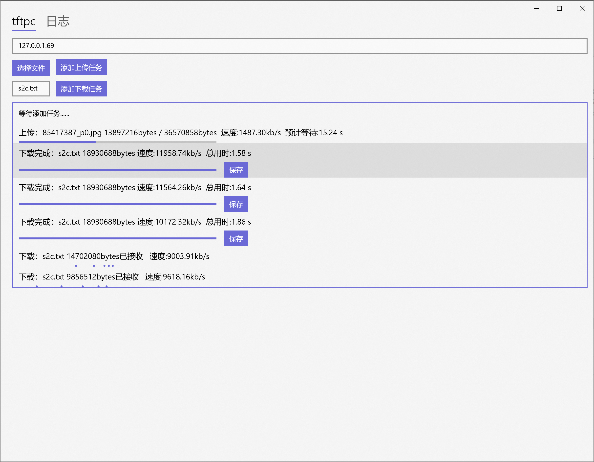

# tftpc-winapp
hustcse socket编程，实现tftpc客户端。

- 使用uwp c++/cx编写
- 只使用octet模式传输，支持多任务




## 文件目录
- 主要逻辑在`MainPage.xaml.cpp`中。

## 可执行文件安装说明
侧载安装打包好的uwp应用需要安装证书。
- 安装证书`tftpc-winapp_1.0.5.0_x86_x64.cer`到**信任区**
- 双击后缀为msixbundle的文件进行安装(提示程序不可信请尝试重新安装证书到其他信任区)

## 本地回环网络屏蔽解除
由于微软限制，uwp应用存在本地回环网络隔离，若要在本机同时运行服务器与客户端请在管理员权限执行
```
CheckNetIsolation.exe LoopbackExempt -is -n=1a44ef09-fda9-4bf2-b241-a05b03bbba81_28n3xemxaqhf2
```

## 卸载说明
- 系统设置-应用与功能找到该程序卸载
- 使用win+s搜索进入证书设置，卸载证书
